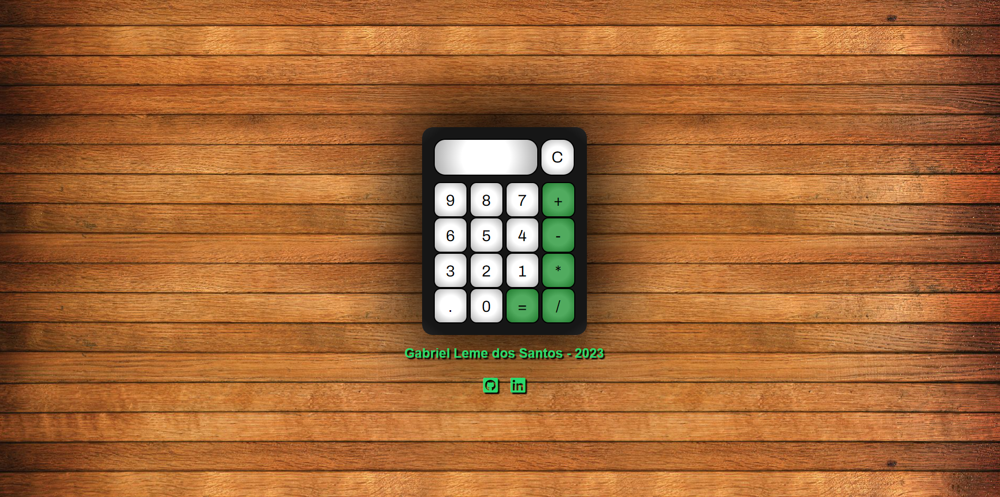

# Calculadora

## Deploy do projeto

<https://calculadora-gabriel-leme-dos-santos.vercel.app/>

Este é um projeto de uma calculadora usando HTML, CSS e Javascript. Os ícones abaixo do meu nome levam para os meus perfis no Linkedin e GitHub.

## Tabela de Conteúdos

- [Recursos Usados](#recursos-usados)
- [Autor do Projeto](#autor-do-projeto)

## Recursos Usados

- [Font Awesome](https://fontawesome.com/) - (biblioteca de ícones usada para este projeto)

## Autor do Projeto

- GitHub - [Gabriel-L-Santos](https://github.com/Gabriel-L-Santos)
- LinkedIn - [Gabriel Leme dos Santos](https://www.linkedin.com/in/gabriel-leme-dos-santos/)